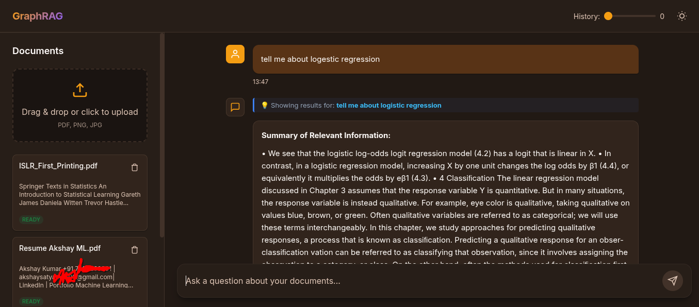

# Multimodal GraphRAG — Architecture Ledger



## System Overview

A production-grade Retrieval-Augmented Generation system combining dense/sparse hybrid search,
adaptive document-scale chunking, hierarchical section breadcrumb context, knowledge graph traversal,
and cross-encoder re-ranking to deliver grounded, hallucination-free responses from uploaded PDF and image documents.

---

## High-Level Architecture

```
┌──────────────────────────────────────────────────────────────────────┐
│                        Frontend (Vanilla JS)                        │
│  ┌──────────┐  ┌────────────┐  ┌───────────┐  ┌──────────────────┐ │
│  │ Chat View│  │ Doc Manager│  │Theme Toggle│  │ Context Slider   │ │
│  └──────────┘  └────────────┘  └───────────┘  └──────────────────┘ │
└───────────────────────────┬──────────────────────────────────────────┘
                            │ REST
┌───────────────────────────▼──────────────────────────────────────────┐
│                     Flask Application Server                         │
│  ┌──────────┐  ┌──────────────┐  ┌────────────┐  ┌──────────────┐  │
│  │ /api/docs│  │ /api/chat    │  │ /api/ingest│  │ /api/status  │  │
│  └──────────┘  └──────────────┘  └────────────┘  └──────────────┘  │
└──┬────────────────┬──────────────────┬───────────────────┬──────────┘
   │                │                  │                   │
   ▼                ▼                  ▼                   ▼
┌──────┐    ┌────────────┐     ┌─────────────┐    ┌────────────────┐
│Neo4j │    │ Qdrant     │     │ Celery +    │    │ LLM Provider   │
│Graph │    │ Vector DB  │     │ Redis Queue │    │ (Configurable) │
│  DB  │    │            │     │             │    │                │
└──────┘    └────────────┘     └─────────────┘    └────────────────┘
```

## Data Flow — Ingestion Pipeline

1. User uploads PDF/images via `/api/ingest`
2. FastAPI validates, persists raw file to `./uploads/`, returns task ID
3. Celery worker picks up the task:
   a. PDF → PyMuPDF page extraction; Images → OCR via pytesseract + vision model
   b. Contextual chunking: LLM generates document-level summary, prepends to each chunk
   c. Dense embeddings generated via sentence-transformers
   d. Sparse embeddings generated via BM25 tokenization
   e. Vectors upserted into Qdrant with metadata (doc_id, chunk_index, page)
   f. Entity-relationship extraction via LLM → triples inserted into Neo4j
4. Progress broadcast via Redis pub/sub → frontend progress tracker

## Data Flow — Retrieval Pipeline

1. User sends query via `/api/chat`
2. Stage 1 — Hybrid Retrieval:
   - Dense query embedding → Qdrant ANN search
   - Sparse BM25 query → Qdrant sparse search
   - Reciprocal Rank Fusion merges both result sets
3. Stage 2 — GraphRAG Expansion:
   - Extract entities from top-k RRF chunks
   - Traverse Neo4j 1-2 hops from matched entities
   - Pull structurally connected cross-document context
4. Stage 3 — Re-ranking:
   - Cross-encoder scores all expanded chunks against query
   - Top-N chunks selected by relevance score
5. Stage 4 — Grounded Generation:
   - LLM generates answer strictly from retrieved context
   - If context insufficient → explicit "I don't have enough information" response

## Data Flow — Cascading Document Purge

1. User deletes document via `/api/docs/{doc_id}`
2. All vector chunks with `doc_id` deleted from Qdrant
3. All Neo4j nodes/edges tagged with `doc_id` removed
4. Raw file removed from `./uploads/`
5. SQLite metadata row purged

## Technology Stack

| Layer            | Technology                     | Notes                                      |
|------------------|--------------------------------|--------------------------------------------|
| API Server       | Flask + Flask-CORS             | Sync server with ThreadPoolExecutor for async tasks |
| Task Queue       | Celery + Redis                 | Falls back to ThreadPoolExecutor if Redis is absent |
| Vector Store     | Qdrant                         | Local file-backed; in-memory fallback in tests |
| Graph Store      | SQLite (local) / Neo4j (opt.)  | SQLite by default; Neo4j supported via env config |
| Metadata Store   | SQLite (aiosqlite)             | Stores doc records, chunk counts, ingestion progress |
| LLM Integration  | OpenAI-compatible (via env)    | Works with Ollama, LMStudio, or any OAI-compatible API |
| Embeddings       | all-MiniLM-L6-v2 (local)      | 384-dim dense vectors; deterministic fallback if absent |
| Cross-Encoder    | ms-marco-MiniLM-L-6-v2 (local)| Passage re-ranking; falls back to token overlap scoring |
| Sparse Retrieval | BM25 + MD5 feature hashing     | Token-frequency vectors stored in Qdrant sparse index |
| PDF Parsing      | PyMuPDF (fitz)                 | Tesseract OCR fallback for scanned/image-only pages |
| OCR              | pytesseract + Pillow           | Used for image uploads and scanned PDF pages |
| Frontend         | Vanilla HTML/CSS/JS            | Single-page app served directly by Flask |
| Testing          | pytest + pytest-asyncio        | Full backend coverage; standalone integration tests |

## Directory Structure

```
RAG/
├── .env                          # All secrets and config
├── .env.example                  # Template for new deployments
├── .gitignore
├── .project_state.json           # Resumption state ledger
├── requirements.txt              # Python dependencies
├── run_local_tests.sh            # Unified test runner
├── docs/
│   └── architecture_ledger.md    # This file
├── uploads/                      # Raw uploaded documents
├── backend/
│   ├── __init__.py
│   ├── main.py                   # Flask app entry point, all route handlers
│   ├── config.py                 # Env-based settings via dataclasses
│   ├── database.py               # SQLite schema + async CRUD (aiosqlite)
│   ├── models.py                 # Pydantic request/response schemas
│   ├── routes/                   # (reserved for future route extraction)
│   ├── services/
│   │   ├── __init__.py
│   │   ├── ingestion.py          # PDF/image parsing, contextual chunking
│   │   ├── embeddings.py         # Dense + sparse vector generation
│   │   ├── graph.py              # SQLite graph store + optional Neo4j routing
│   │   ├── vector_store.py       # Qdrant collection management and search
│   │   ├── retrieval.py          # Hybrid search, RRF fusion, graph expansion
│   │   ├── reranker.py           # Cross-encoder re-ranking with heuristic fallback
│   │   └── llm.py                # LLM client, offline heuristic fallbacks
│   └── workers/
│       ├── __init__.py
│       └── tasks.py              # Celery task for async document ingestion
├── frontend/
│   ├── index.html                # Single-page application shell
│   ├── css/
│   │   └── styles.css            # Complete responsive styles + theming
│   └── js/
│       ├── app.js                # Application controller
│       ├── api.js                # Backend API client
│       ├── chat.js               # Chat interface logic
│       ├── documents.js          # Document management UI
│       ├── theme.js              # Light/dark mode engine
│       └── slider.js             # Context history slider
└── tests/
    ├── __init__.py
    ├── conftest.py               # Shared fixtures
    ├── test_config.py
    ├── test_documents.py
    ├── test_ingestion.py
    ├── test_embeddings.py
    ├── test_vector_store.py
    ├── test_graph.py
    ├── test_retrieval.py
    ├── test_reranker.py
    ├── test_chat.py
    ├── test_cascading_purge.py
    └── test_frontend.py          # Playwright UI tests
```

## Configuration Schema (.env)

```
LLM_BASE_URL=http://localhost:11434/v1
LLM_API_KEY=not-needed
LLM_MODEL=llama3
LLM_TEMPERATURE=0.1
LLM_MAX_TOKENS=2048

EMBEDDING_MODEL=all-MiniLM-L6-v2
CROSS_ENCODER_MODEL=cross-encoder/ms-marco-MiniLM-L-6-v2

QDRANT_HOST=localhost
QDRANT_PORT=6333
QDRANT_COLLECTION=rag_chunks

NEO4J_URI=bolt://localhost:7687
NEO4J_USER=neo4j
NEO4J_PASSWORD=password

REDIS_URL=redis://localhost:6379/0

SQLITE_PATH=./data/metadata.db

SIMILARITY_THRESHOLD=0.25
TOP_K_RETRIEVAL=20
TOP_K_RERANK=5
RRF_K=60

UPLOAD_DIR=./uploads
MAX_UPLOAD_SIZE_MB=100
CHUNK_SIZE=512
CHUNK_OVERLAP=64
```

---

## Change Log

| Date       | Change                                                  | Files Affected                        |
|------------|---------------------------------------------------------|---------------------------------------|
| 2026-07-18 | Initial architecture specification                      | docs/architecture_ledger.md           |
| 2026-07-31 | Codebase humanization: rewrote all docstrings/comments  | backend/services/*.py                 |
| 2026-07-31 | Fixed API server layer: Flask (not FastAPI)             | docs/architecture_ledger.md           |
| 2026-07-31 | Corrected tech stack: SQLite as default graph store     | docs/architecture_ledger.md           |
